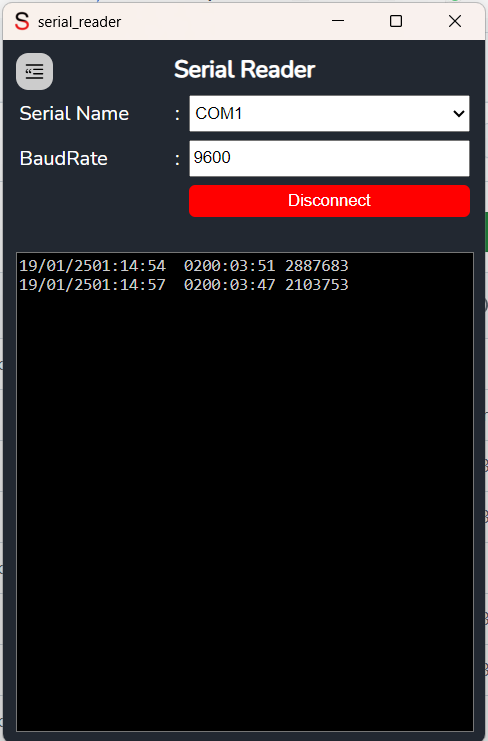

# Serial Reader Windows
 
 



Here’s the updated `README.md` file that explains how to use the pre-built release or build from source using Wails:
 
# Serial Reader Windows

Serial Reader Windows is an open-source application that allows users to read data from serial ports on Windows with a more attractive and user-friendly interface. This application simplifies interacting with devices connected via serial ports, such as microcontrollers, sensors, and other hardware.

## Features

- **Simple and Intuitive User Interface**: Enjoy a pleasant and easy experience when reading serial data.
- **Windows Compatibility**: Works on Windows 10/11 with support for various serial devices.
- **Automatic Port Detection**: Automatically detects and connects to available serial ports. 
- **Real-time Data Display**: Displays data received from the device in real time.

## Installation

### Pre-built Release

You can easily use **Serial Reader Windows** without having to build it yourself. Simply download the latest release from the [Release page](https://github.com/nnttoo/serial_reader/releases). No installation is required; just download the `.exe` file for Windows and run it directly.


## Usage

1. **Launch the Application**:
   After downloading or building the application, you'll be presented with a simple and intuitive user interface.

2. **Select Serial Port**:
   Choose the serial port that is connected to your device from the available dropdown list.

3. **Read Data**:
   Click the "Connect" button to start reading data from the device. The data will be displayed in real time in the main window.
 

## Built With

This application is built using the [Wails Framework](https://wails.io/), a Go-based framework for creating modern desktop applications using web technologies such as HTML, CSS, and JavaScript.


### Build from Source

If you'd like to build the application from source, follow these steps:

#### Prerequisites

- Windows 10/11
- [Wails Framework](https://wails.io/) installed (follow the [installation guide](https://wails.io/docs/getting-started)).
- Go 1.18+ installed (if you haven't already).

#### Steps

1. **Clone the Repository**:
   ```bash
   git clone https://github.com/nnttoo/serial_reader.git
   ```

2. **Install Dependencies**:
   Navigate to the project directory and install the required dependencies by running:
   ```bash
   wails doctor
   ```

3. **Build the Application**:
   To build the application from source, simply run:
   ```bash
   wails build
   ```
   This will generate an executable for Windows in the `build/bin` directory.

4. **Run the Application**:
   After building, you can run the application from the `build/bin` directory.

5. **Configure Serial Port**:
   After launching the app, select the desired serial port from the dropdown in the app and click "Connect" to start reading data.


## Contributing

We welcome contributions from the community! If you have any ideas, bug fixes, or improvements, feel free to open an issue or submit a pull request.

Steps to contribute:

1. Fork this repository.
2. Create a new branch (`git checkout -b new-feature`).
3. Make changes and commit them (`git commit -am 'Add new feature'`).
4. Push the branch to your forked repository (`git push origin new-feature`).
5. Create a pull request.

## License

This project is licensed under the **MIT License**. See the [LICENSE](LICENSE) file for more details.
 
Thank you for using Serial Reader Windows! 